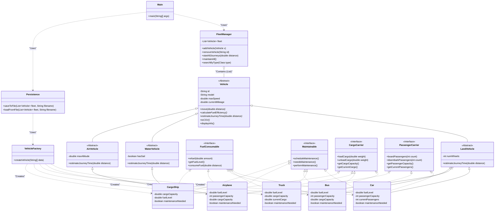

# Fleet Manager Application - UML & Architecture Documentation

This document provides a detailed overview of the class hierarchy, interfaces, and object relationships within the **FleetManagerAP** project. It utilizes Unified Modeling Language (UML) concepts to explain how the system is structured.

## 1. UML Class Diagram

The following Mermaid diagram illustrates the structure of the application, including inheritance, interface implementation, and dependencies.

## 2. Class Relationships Explained

### Inheritance ("Is-A" Relationship)
The project uses a deep inheritance hierarchy to share common logic while allowing specific behaviors.

*   **`Vehicle` (Abstract)**: The root of the hierarchy. It defines properties common to all vehicles (`id`, `model`, `maxSpeed`, `currentMileage`) and abstract methods that must be implemented by subclasses (`move`, `calculateFuelEfficiency`).
*   **Intermediate Abstract Classes**:
    *   **`LandVehicle`**: Extends `Vehicle`. Adds `numWheels` and implements `estimateJourneyTime` with a traffic factor.
    *   **`WaterVehicle`**: Extends `Vehicle`. Adds `hasSail` and implements `estimateJourneyTime` with a water current factor.
    *   **`AirVehicle`**: Extends `Vehicle`. Adds `maxAltitude` and implements `estimateJourneyTime` with a speed advantage factor.
*   **Concrete Classes**: `Car`, `Truck`, `Bus`, `Airplane`, and `CargoShip` extend their respective category classes.

### Interfaces ("Can-Do" Capabilities)
Interfaces define specific capabilities that vehicles can possess. This allows for polymorphism where the `FleetManager` can treat different vehicles similarly based on what they *can do*.

*   **`FuelConsumable`**: Implemented by vehicles that use fuel (`Car`, `Truck`, `Bus`, `Airplane`, `CargoShip`). Defines methods for refueling and consuming fuel.
*   **`PassengerCarrier`**: Implemented by vehicles that carry people (`Car`, `Bus`, `Airplane`). Defines methods for boarding and disembarking.
*   **`CargoCarrier`**: Implemented by vehicles that haul goods (`Truck`, `Bus`, `Airplane`, `CargoShip`). Defines methods for loading and unloading cargo.
*   **`Maintainable`**: Implemented by all concrete vehicles. Defines methods to schedule and perform maintenance.

### Composition / Aggregation ("Has-A" Relationship)
*   **`FleetManager` has a `List<Vehicle>`**: The `FleetManager` class maintains a list of `Vehicle` objects. This is an aggregation relationship because the `FleetManager` "owns" the collection of vehicles for the purpose of the application, managing their lifecycle within the runtime.

### Dependency ("Uses-A" Relationship)
*   **`Main` depends on `FleetManager`**: The main entry point creates and uses an instance of `FleetManager` to perform operations.
*   **`Persistence` depends on `VehicleFactory`**: The persistence layer uses the factory to reconstruct vehicle objects from CSV data.
*   **`VehicleFactory` depends on Concrete Vehicles**: The factory needs to know about `Car`, `Truck`, etc., to instantiate them based on string input.

## 3. Detailed Class Descriptions

### Core Package: `Vehicles`
*   **`Vehicle`**: Abstract base class. Implements `Comparable<Vehicle>` to allow sorting by fuel efficiency.
*   **`Car`**: A standard passenger vehicle. Implements `PassengerCarrier` and `FuelConsumable`.
*   **`Truck`**: A cargo vehicle. Implements `CargoCarrier` and `FuelConsumable`. Fuel efficiency drops when heavily loaded.
*   **`Bus`**: A hybrid vehicle that carries both passengers and cargo. Implements both `PassengerCarrier` and `CargoCarrier`.
*   **`Airplane`**: High-speed air transport. Implements all interfaces.
*   **`CargoShip`**: Water transport. Can be sail-powered (no fuel) or engine-powered.

### Core Package: `fleetManager`
*   **`FleetManager`**: The central controller.
    *   `addVehicle(Vehicle v)`: Adds a vehicle to the fleet.
    *   `startAllJourneys(double distance)`: Triggers the `move()` method on all vehicles.
    *   `maintainAll()`: Checks `needsMaintenance()` on all `Maintainable` vehicles and performs it.
    *   `generateReport()`: Aggregates statistics about the fleet.

### Core Package: `Persistence`
*   **`Persistence`**: Handles File I/O.
    *   `saveToFile`: Serializes the fleet to a CSV file.
    *   `loadFromFile`: Reads a CSV file and uses `VehicleFactory` to rebuild the fleet.
*   **`VehicleFactory`**: A helper class that parses a CSV line and returns the correct `Vehicle` subclass instance.

### Core Package: `Interfaces`
*   **`FuelConsumable`**, **`Maintainable`**, **`CargoCarrier`**, **`PassengerCarrier`**: Contract definitions for vehicle capabilities.

### Core Package: `CustomExceptions`
*   **`InvalidOperationException`**: Thrown for general errors (e.g., negative distance).
*   **`InsufficientFuelException`**: Thrown when a vehicle tries to move without enough fuel.
*   **`OverloadException`**: Thrown when exceeding cargo or passenger capacity.
